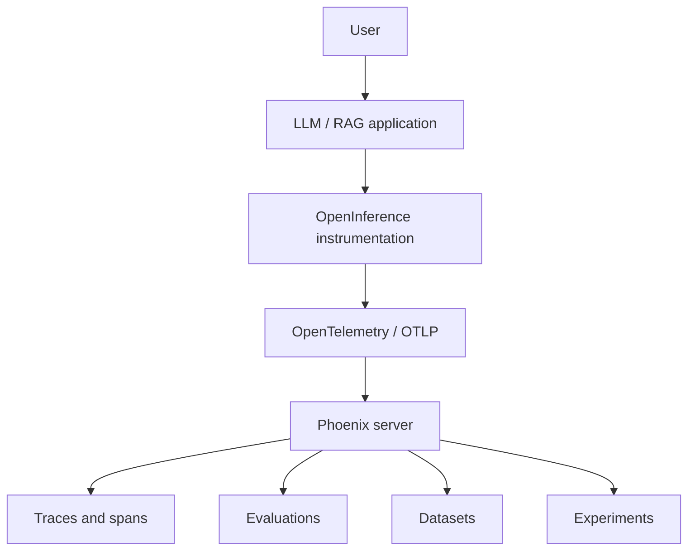
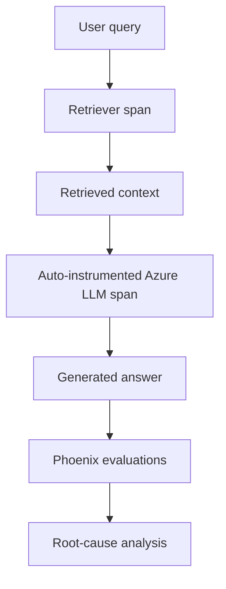
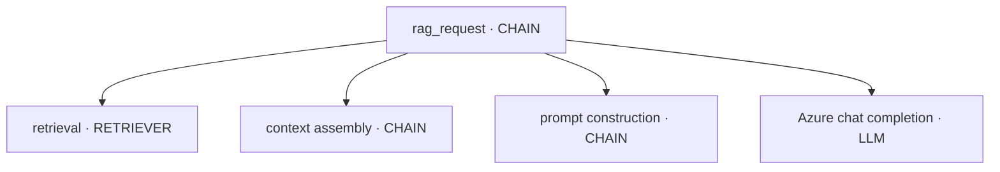
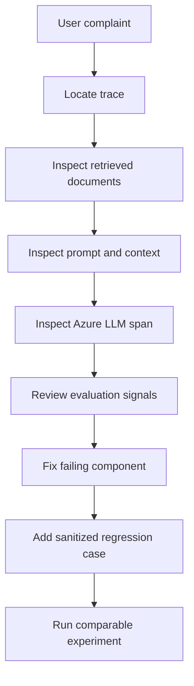

# Arize Phoenix LLM & RAG Observability with Azure OpenAI

A production-oriented starter and learning repository for tracing, evaluating, experimenting with,
and troubleshooting LLM, RAG, and lightweight agent applications using
[Arize Phoenix](https://github.com/Arize-ai/phoenix), OpenTelemetry, OpenInference, and Azure OpenAI.

> **Verified 11 August 2026.** The code is pinned to Phoenix Server `19.21.0`, Phoenix Client
> `3.0.0`, Phoenix Evals `3.4.0`, Phoenix OTel `0.17.1`, OpenInference OpenAI instrumentation
> `0.1.54`, and OpenAI Python `2.53.0`. See [Version compatibility](#version-compatibility).

The central engineering workflow is:

> **Trace + Evaluation + Dataset + Experiment + Troubleshooting**

The goal is not merely to record that a chatbot returned `200 OK`. It is to move from “the answer
was wrong” to an evidence-backed diagnosis such as “the relevant refund chunk ranked below Top-K,”
“the correct context was retrieved but the model contradicted it,” or “the agent repeated the same
tool call and increased latency.”

## What is Arize Phoenix?

Phoenix is an open-source AI observability and evaluation platform. It accepts OpenTelemetry traces,
understands OpenInference semantic conventions, visualizes LLM/RAG/agent spans, stores annotations,
and provides datasets and experiments for repeatable quality analysis.

Phoenix helps inspect:

- LLM prompts, responses, deployments, token usage, latency, and failures
- RAG retrieval queries, ranked documents, scores, metadata, and context assembly
- agent orchestration, tool selection, tool input/output, retries, and failures
- evaluation scores and explanations attached to spans, traces, or experiments
- controlled datasets and comparable prompt, model, and retrieval experiments

Traditional monitoring can say “the request completed.” It cannot say whether the answer was
faithful, relevant, or correct. Mature LLM systems need operational telemetry and quality signals.

## Architecture





The Phoenix server is both an OTLP collector and the analysis UI. `phoenix.otel.register()` creates
an OpenTelemetry tracer provider and exporter. `OpenAIInstrumentor` automatically traces Azure
OpenAI chat and embedding SDK calls. OpenInference-aware manual spans describe custom retrievers,
prompt assembly, tools, and agents.

## Repository capabilities

| Area | Demonstration |
|---|---|
| LLM tracing | Azure chat call, messages, deployment, tokens, latency, errors |
| RAG tracing | Root chain, retriever, document attributes, prompt construction, LLM child span |
| Embeddings | Optional Azure embedding retriever; SDK calls are automatically traced |
| Agent tracing | Agent root, deterministic tool selection, tool span/result, final LLM call |
| Evaluation | Faithfulness, hallucination, document relevance, answer relevance, correctness |
| Datasets | Local JSON plus Phoenix Client `datasets.create_dataset()` |
| Experiments | Same dataset across prompt, Top-K, retriever, or deployment variants |
| Troubleshooting | Broken retriever, weak prompt, excessive context, and missing context |
| Reports | Computed JSON and CSV summaries; no fabricated runtime scores |
| CI/CD | Unit/lint/offline gate plus opt-in Azure judge gate with GitHub Secrets |
| Privacy | Trace content redacted by default; fictional sample data only |

## Quick start

### 1. Clone and install

```bash
git clone https://github.com/ashokmanohar-ai/phoenix-llm-observability.git
cd phoenix-llm-observability
python -m venv .venv
```

Windows PowerShell:

```powershell
.venv\Scripts\Activate.ps1
python -m pip install -r requirements.txt
```

macOS/Linux:

```bash
source .venv/bin/activate
python -m pip install -r requirements.txt
```

For editable development:

```bash
python -m pip install -e ".[dev,server]"
```

### 2. Start Phoenix

The recommended persistent local path is Docker Compose:

```bash
docker compose up -d
```

Open <http://localhost:6006>. The Compose file exposes `6006` for the UI, REST API, and OTLP/HTTP,
and `4317` for OTLP/gRPC. Data is persisted in a named volume. The image is version-pinned.

For a learning-only Python launch:

```bash
python scripts/start_phoenix.py
```

The Python launch uses `phoenix.launch_app()` and is convenient for notebooks or demos; use a
container with PostgreSQL, authentication, backups, and managed retention for production.

### 3. Configure Azure OpenAI and Phoenix

```bash
cp .env.example .env
```

Set:

```dotenv
AZURE_OPENAI_API_KEY=...
AZURE_OPENAI_ENDPOINT=https://your-resource.openai.azure.com
AZURE_OPENAI_API_VERSION=your-supported-api-version
AZURE_OPENAI_CHAT_DEPLOYMENT=your-chat-deployment
AZURE_OPENAI_EMBEDDING_DEPLOYMENT=your-embedding-deployment
AZURE_OPENAI_EVALUATOR_DEPLOYMENT=your-judge-deployment
```

The application and evaluator deployments are deliberately separate. The judge may use a more
stable or capable deployment, and its quality/cost should be measured independently.

`.env` is ignored. Do not print `Settings` or environment dictionaries. GitHub Actions reads Azure
credentials only from GitHub Secrets.

Trace content is redacted by default. Because this repository uses fictional data, you can inspect
full prompts and outputs locally by setting:

```dotenv
PHOENIX_TRACE_CONTENT=true
```

Do not enable full content in production until privacy and security review is complete.

### 4. Run the examples

```bash
python examples/basic_llm_trace.py
python examples/rag_trace.py
python examples/evaluation.py
python examples/dataset_evaluation.py
python examples/agent_trace.py
```

Inspect the resulting project in Phoenix at <http://localhost:6006>.

### 5. Run tests and the headless quality gate

```bash
ruff check .
pytest -v --cov=phoenix_observability
python scripts/run_evaluation.py \
  --dataset datasets/regression_dataset.json \
  --mode offline \
  --enforce
```

The offline mode is a deterministic token-overlap smoke test. It is intentionally not presented as
semantic LLM evaluation. Run current Phoenix evaluators with Azure:

```bash
python scripts/run_evaluation.py \
  --dataset datasets/regression_dataset.json \
  --mode azure \
  --enforce
```

Reports are written to `reports/evaluation_results.json` and `.csv` and are ignored by Git.

## Trace versus span

A **trace** is the complete path of one request. A **span** is one timed operation within that path.



OpenInference `openinference.span.kind` values drive Phoenix's AI-specific trace tree. The project
uses `CHAIN`, `RETRIEVER`, `AGENT`, and `TOOL` manually; the OpenAI instrumentor emits `LLM` and
`EMBEDDING` spans and captures actual SDK usage when Azure returns it.

## Retriever observability

The retriever span records:

- query (redacted unless enabled), Top-K, result count, and actual duration
- document IDs, similarity scores, metadata, and optional bounded previews
- errors and exception events

Select `RAG_RETRIEVER_MODE=lexical` for a dependency-free learning path or
`RAG_RETRIEVER_MODE=azure_embeddings` to trace Azure embedding calls. The latter caches knowledge-
base embeddings within the process and embeds each query.

Retrieval spans help distinguish missing documents, wrong ranking, noisy Top-K, embedding problems,
and metadata-filter errors from generation failures.

## RAG evaluation

Phoenix Evals `3.4.0` uses modern evaluator objects. This repository uses:

| Signal | Current API | Required fields | Direction |
|---|---|---|---|
| Faithfulness | `FaithfulnessEvaluator` | input, output, context | maximize |
| Hallucination | `HallucinationEvaluator` | conversation input, output | minimize |
| Retrieval relevance | `DocumentRelevanceEvaluator` | input, document_text | maximize |
| General correctness | `CorrectnessEvaluator` | input, output | maximize |
| Answer relevance | custom `ClassificationEvaluator` | input, output | maximize |
| Reference correctness | custom `ClassificationEvaluator` | input, output, reference | maximize |

The built-in `CorrectnessEvaluator` is currently a general correctness judge and does not consume a
reference answer. The repository therefore implements reference-aware correctness as a current,
non-legacy `ClassificationEvaluator`.

Faithfulness and relevance are different. A response can faithfully repeat an irrelevant retrieved
document and still fail to answer the question.

## Connect evaluations to traces

Use evaluation combinations as diagnostic evidence:

| Retrieval relevance | Faithfulness | Answer relevance | Likely diagnosis |
|---|---|---|---|
| Low | High | Low/variable | Retriever returned poor context; generation used it faithfully |
| High | Low | Variable | Correct evidence was present; prompt/model made unsupported claims |
| High | High | Low | Evidence and grounding are sound; instruction following is weak |
| High | High | High | Quality path is healthy; inspect latency/tokens if operationally poor |

For example, low context relevance and high faithfulness points to retrieval, not the LLM. This is
why attaching evaluations to the relevant span or experiment is more useful than a detached score.

To attach the four computed scores directly to an existing span:

```bash
python examples/trace_evaluation.py --span-id YOUR_PHOENIX_SPAN_ID --case-id rag-001-correct
```

The example uses Phoenix Client `spans.add_span_annotation(..., annotator_kind="LLM", sync=True)`.

## Troubleshoot a wrong refund answer



Generate deliberately broken traces:

```bash
python examples/troubleshooting.py broken-retriever
python examples/troubleshooting.py broken-prompt
python examples/troubleshooting.py excessive-context
python examples/troubleshooting.py missing-context
```

See [Troubleshooting](docs/TROUBLESHOOTING.md) for the root-cause decision tree and all 15 cases.

## Latency, tokens, and cost

Span duration is measured by OpenTelemetry; no fake timing is written. The RAG result also carries
actual Azure SDK latency and usage. Inspect root duration and child spans to find whether retrieval,
embeddings, the LLM, or tool loops dominate.

The OpenAI instrumentation records prompt, completion, and total token attributes when returned by
Azure. Large input counts can reveal oversized context, history, or repeated calls.

Phoenix/OpenInference supports cost attributes, but Azure price schedules vary by deployment,
region, contract, and time. This repository does not invent price data. If cost is calculated in your
application, version the price table and mark it as an application-side estimate.

## Datasets and experiments

Production traces explain what actually happened. Datasets define controlled, repeatable examples.
Experiments run the same cases against a candidate task and comparable evaluators.

Upload the regression dataset:

```bash
python scripts/upload_dataset.py
```

Run prompt/Top-K experiments:

```bash
python examples/experiment.py --upload --prompt-version v1 --top-k 3
python examples/experiment.py --prompt-version v2 --top-k 5
```

For a fair model comparison, change `AZURE_OPENAI_CHAT_DEPLOYMENT` and rerun the same dataset with
the same prompt, retriever, evaluator deployment, evaluator prompts, and thresholds. Store deployment
names and configuration in experiment metadata.

The production-failure loop is:

```text
Locate trace -> sanitize -> add reference -> add dataset example -> fix -> experiment -> retain case
```

`scripts/production_failure_to_dataset.py` demonstrates the conversion and marks the new example
`privacy_reviewed=false` so it cannot silently bypass review.

## CI/CD quality gates

The workflow has two jobs:

1. Every PR/push: lint, unit tests, coverage, deterministic regression smoke gate, reports.
2. Manual opt-in: local headless Phoenix service plus Azure OpenAI Phoenix Evals using GitHub Secrets.

Configure these repository secrets:

- `AZURE_OPENAI_API_KEY`
- `AZURE_OPENAI_ENDPOINT`
- `AZURE_OPENAI_API_VERSION`
- `AZURE_OPENAI_CHAT_DEPLOYMENT`
- `AZURE_OPENAI_EMBEDDING_DEPLOYMENT`
- `AZURE_OPENAI_EVALUATOR_DEPLOYMENT`

Example thresholds are `0.80` faithfulness and `0.75` for answer relevance, retrieval relevance, and
correctness. They are not universal quality standards. Calibrate them with representative examples,
human review, evaluator validation, and tolerance for false positives/negatives.

To enforce relative regression as well as absolute thresholds, retain a computed baseline report and
compare it with the candidate report:

```bash
python scripts/check_regression.py \
  --baseline artifacts/baseline/evaluation_results.json \
  --candidate reports/evaluation_results.json \
  --max-drop 0.05
```

The script reads real report values; the repository does not hard-code illustrative baseline scores
as if they were an actual run.

CI does not expose the Phoenix UI publicly. The service is local to the runner, and report artifacts
are uploaded after the job.

## Logging versus tracing versus evaluation

| Signal | Question | Example |
|---|---|---|
| Logging | What event happened? | Retriever returned 5 documents |
| Tracing | What happened throughout the request? | Query → retrieval → prompt → LLM → response |
| Evaluation | Was the result good? | Faithfulness = faithful; relevance = unrelated |

**Observability** explains what happened. **Evaluation** judges whether it was good. Phoenix connects
the two, so a quality score can be interpreted in the actual request path.

Offline evaluation uses curated cases before deployment for prompt, model, and retrieval regression.
Online/production evaluation samples real traces to detect new behavior. Online judging requires
privacy review, cost controls, sampling, latency isolation, and evaluator monitoring.

## Production checklist

- redact or avoid PII, credentials, authorization headers, and sensitive document text
- sample traces intentionally and separate development, staging, and production projects
- use authentication/RBAC, TLS, PostgreSQL, backups, retention, and capacity monitoring
- version knowledge sources, prompts, datasets, evaluator prompts, and threshold policy
- cap agent loops, retries, context size, and evaluation concurrency
- validate judge models against human-labelled examples and monitor evaluator drift
- export only necessary attributes; never log embedding vectors by default
- review failed production traces before converting them into reusable datasets

See [Production observability](docs/PRODUCTION_OBSERVABILITY.md).

## Tool comparison

| Tool | Primary strength |
|---|---|
| Arize Phoenix | Observe, trace, evaluate in context, troubleshoot, curate datasets, run experiments |
| DeepEval | LLM unit tests and metric-driven evaluation |
| RAGAS | RAG-specific retrieval and generation metrics |
| Promptfoo | Prompt/model regression, CI quality gates, and AI red teaming |

They are complementary: Phoenix can reveal where a request failed; specialized test frameworks can
add focused regression or security suites.

## Version compatibility

| Package | Verified version | Why it is present |
|---|---:|---|
| `arize-phoenix` | 19.21.0 | Self-hosted server and Python demo launch |
| `arize-phoenix-client` | 3.0.0 | REST client, datasets, traces, annotations, experiments |
| `arize-phoenix-evals` | 3.4.0 | Modern evaluator API, including Hallucination |
| `arize-phoenix-otel` | 0.17.1 | `register`, OpenInference-aware tracer/helpers |
| `openinference-instrumentation-openai` | 0.1.54 | OpenAI/Azure OpenAI auto-instrumentation |
| `openinference-semantic-conventions` | 0.1.32 | Canonical AI span attributes/kinds |
| `openai` | 2.53.0 | `AzureOpenAI` chat and embeddings client |

Official references used for the implementation:

- [Phoenix OpenAI tracing (explicitly supports Azure OpenAI)](https://arize.com/docs/phoenix/integrations/llm-providers/openai/openai-tracing)
- [Phoenix tracing helpers](https://arize.com/docs/phoenix/tracing/how-to-tracing/setup-tracing/instrument)
- [Phoenix Evals metrics](https://arize.com/docs/phoenix/evaluation/pre-built-metrics)
- [Phoenix datasets](https://arize.com/docs/phoenix/datasets-and-experiments/how-to-datasets/creating-datasets)
- [Phoenix experiments](https://arize.com/docs/phoenix/datasets-and-experiments/how-to-experiments)
- [Phoenix Docker deployment](https://arize.com/docs/phoenix/self-hosting/deployment-options/docker)
- [OpenInference semantic conventions](https://arize.com/docs/phoenix/tracing/concepts-tracing/otel-openinference/semantic-conventions)

Legacy Phoenix evaluator templates and old experimental APIs are deliberately excluded.

## Documentation map

- [Tracing](docs/TRACING.md)
- [RAG observability](docs/RAG_OBSERVABILITY.md)
- [Evaluation](docs/EVALUATION.md)
- [Experiments and regression](docs/EXPERIMENTS.md)
- [Troubleshooting](docs/TROUBLESHOOTING.md)
- [Production observability](docs/PRODUCTION_OBSERVABILITY.md)

## License

MIT. The fictional ExampleCo policies are included only as sample data.
