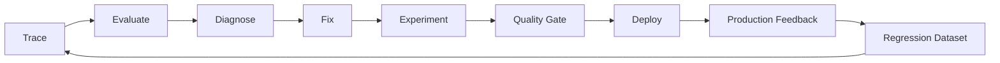
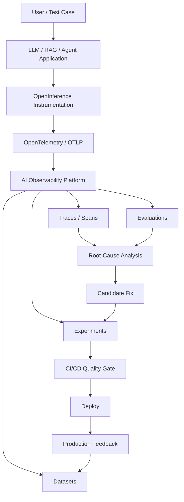

# AI Observability for Quality Engineers

## Tracing LLMs, RAG Pipelines and AI Agents from Prompt to Production

**Technical White Paper — Version 1.0**  
**September 2026**

**Author:** Ashok Kumar Manohar  
**GitHub:** [ashokmanohar-ai](https://github.com/ashokmanohar-ai)  
**Primary reference implementation:** [Phoenix LLM Observability](https://github.com/ashokmanohar-ai/phoenix-llm-observability)  
**Related Quality Engineering implementations:** [LLM Quality Evaluation Harness](https://github.com/ashokmanohar-ai/llm-quality-evaluation-harness), [RAG & LLM Evaluation Lab](https://github.com/ashokmanohar-ai/rag-llm-evaluation-lab), [AI Agent Evaluation Framework](https://github.com/ashokmanohar-ai/ai-agent-evaluation-framework), and [Continuous Quality Engineering](https://github.com/ashokmanohar-ai/continuous-quality-engineering)

> **Publication note:** This is an independent technical white paper supported by open-source reference implementations. It is not a peer-reviewed academic publication, legal opinion, compliance certification, security certification, or statement of production readiness. Production adoption requires environment-specific security, privacy, observability, model-risk, retention and governance review.

---

## Abstract

Traditional software observability answers questions such as: Did the service respond? How long did it take? Which dependency failed? How much CPU or memory was consumed? Those questions remain essential, but AI-enabled applications introduce a second class of questions that conventional telemetry does not answer well by itself.

A large language model request can return `200 OK` while producing an unsupported answer. A Retrieval-Augmented Generation system can have healthy infrastructure while retrieving the wrong document. An AI agent can complete successfully while calling the wrong tool, repeating a loop, exceeding its intended authority or wasting tokens on unnecessary steps. A model can appear operationally healthy while its quality, grounding, safety or cost silently regress.

This white paper presents **AI Observability for Quality Engineers** as an evidence-driven discipline that connects runtime telemetry with AI evaluation. The framework combines traces, spans, model and prompt metadata, retrieval evidence, tool trajectories, token usage, latency, cost, quality scores, datasets, experiments and production feedback so engineers can move from a vague symptom — “the AI answer was wrong” — to a defensible root-cause statement.

The paper proposes a **Trace–Evaluate–Diagnose–Experiment–Regress model**. Production or test traffic is traced at the component boundary; evaluation signals are attached to the relevant trace or span; failures are localized to retrieval, prompt construction, generation, tool behavior or orchestration; candidate fixes are tested against controlled datasets; and validated production failures become permanent regression cases.

A companion open-source implementation demonstrates Arize Phoenix, OpenTelemetry, OpenInference, Azure OpenAI, LLM tracing, RAG tracing, agent/tool spans, evaluation annotations, datasets, experiments, CI quality gates, privacy-aware telemetry, regression reporting and production-failure-to-dataset workflows.

The central proposition is:

> **AI observability is not complete when a team can see that a request ran; it is complete only when the team can explain what the AI system did, why it did it, whether the behavior was acceptable, where quality failed, and how that evidence will prevent the same failure from silently returning.**

---

## 1. Executive Summary

AI-enabled systems are distributed, probabilistic and evidence-sensitive. A typical RAG or agent request can involve:

```text
User Request
   ↓
Prompt / Policy / Context Assembly
   ↓
Retriever / Search / Embedding
   ↓
LLM Reasoning or Generation
   ↓
Tool Selection / Tool Calls
   ↓
Application or External Service
   ↓
Final Response
```

Every stage can fail independently.

Traditional monitoring may show:

- HTTP status: 200
- latency: 1.4 seconds
- error rate: 0%
- CPU: healthy

But the actual quality problem may be:

- relevant evidence ranked below Top-K;
- the context contained a superseded policy;
- the model ignored correct retrieved evidence;
- an agent selected the wrong tool;
- a tool call used incorrect arguments;
- an agent looped unnecessarily;
- a final answer contained an unsupported claim;
- token usage doubled after a prompt change;
- a model upgrade reduced answer relevance;
- a security policy violation occurred without an infrastructure error.

AI Quality Engineering therefore needs telemetry that describes not only **system health**, but also **behavioral evidence**.

The recommended operating model is:

```text
Observe → Evaluate → Diagnose → Fix → Experiment → Gate → Learn
```

The core distinction is:

| Discipline | Main question |
|---|---|
| Logging | What event happened? |
| Metrics | How often, how much, how fast? |
| Tracing | What happened across the complete request path? |
| Evaluation | Was the AI behavior good, correct, safe or useful? |
| AI observability | Why did the behavior occur, and where should engineering action be taken? |

Quality Engineers should treat observability evidence as an extension of test evidence, not as a separate operations-only concern.

---

## 2. Why Conventional Observability Is Necessary but Insufficient

Distributed tracing was designed to explain software execution across services. It is excellent at identifying slow dependencies, exceptions and request propagation.

AI systems add new variables:

- model provider and deployment;
- prompt version;
- system instructions;
- retrieved documents;
- ranking and similarity scores;
- context-window construction;
- sampling parameters;
- tool definitions;
- tool calls and results;
- agent routes and handoffs;
- token counts;
- evaluator versions;
- dataset versions;
- probabilistic output quality.

A successful infrastructure request therefore does not imply a successful AI interaction.

A Quality Engineering observability model must answer both:

1. **Did the system execute correctly?**
2. **Did the AI behavior satisfy the required quality contract?**

---

## 3. The AI Observability Quality Model

A practical AI observability model can be represented as:

```text
AI Observability Quality
=
Runtime Evidence
+ Behavioral Evidence
+ Evaluation Evidence
+ Governance Evidence
```

### Runtime evidence

- latency;
- retries;
- errors;
- dependency timing;
- token counts;
- throughput;
- resource consumption.

### Behavioral evidence

- prompt and model versions;
- retrieved document IDs;
- ranking positions;
- tool calls;
- tool arguments;
- routing decisions;
- state transitions;
- agent handoffs.

### Evaluation evidence

- correctness;
- answer relevance;
- faithfulness;
- retrieval relevance;
- hallucination;
- safety;
- tool correctness;
- task completion;
- policy compliance.

### Governance evidence

- user/tenant scope;
- approval state;
- data classification;
- redaction policy;
- evaluator version;
- retention policy;
- experiment/baseline identifier.

---

## 4. The Trace–Evaluate–Diagnose–Experiment–Regress Model

The proposed operating cycle is:



### Trace
Capture the actual execution path.

### Evaluate
Attach quality signals to the correct trace, span, session or experiment.

### Diagnose
Identify whether the primary failure belongs to retrieval, context, prompt, model, tool, policy, orchestration or infrastructure.

### Experiment
Run the same controlled dataset against a proposed change.

### Regress
Convert confirmed failures into permanent, versioned test cases.

This closes the loop between production observability and Quality Engineering.

---

## 5. Trace and Span Design

A **trace** represents one complete user interaction. A **span** represents one operation within that interaction.

A RAG trace may look like:

```text
rag_request
├── query_processing
├── embedding
├── retrieval
├── reranking
├── context_assembly
├── prompt_construction
├── llm_generation
└── response_evaluation
```

An agent trace may look like:

```text
agent_request
├── planning
├── tool_selection
├── tool_call
│   ├── tool_input
│   └── tool_result
├── routing
├── llm_generation
└── final_response
```

A good trace model reflects the **engineering control boundaries** of the application. It should not create spans merely because functions exist in code.

---

## 6. OpenTelemetry and OpenInference

OpenTelemetry provides standardized telemetry infrastructure for traces, metrics and logs. Its semantic-convention model enables common naming and correlation across systems.

AI workloads require additional semantics for model calls, messages, retrieval, tools, embeddings and agent operations. OpenInference extends OpenTelemetry concepts with AI-specific span types and attributes.

The reference implementation uses OpenTelemetry transport and OpenInference-aware instrumentation so the observability backend receives structured evidence rather than arbitrary application logs.

This separation is important:

- OpenTelemetry provides the telemetry foundation;
- OpenInference provides AI-specific meaning;
- Phoenix provides storage, visualization, annotation, evaluation, datasets and experiments.

The paper does not require Phoenix specifically; the architectural principles remain applicable to other compatible observability platforms.

---

## 7. What Quality Engineers Should Capture for LLM Calls

Useful LLM observability metadata includes:

- provider;
- deployment/model identifier;
- prompt version;
- evaluator version;
- sampling configuration;
- request latency;
- prompt tokens;
- completion tokens;
- total tokens;
- retry count;
- error type;
- finish reason;
- trace/session/case identifier.

Prompt and response content may be useful during debugging, but must be treated as potentially sensitive data.

Production systems should default to metadata-first telemetry and enable content capture only after privacy/security review.

---

## 8. Prompt Observability

Prompt changes are software changes.

A useful trace should be able to answer:

- Which prompt template was used?
- Which version was deployed?
- Which runtime variables were inserted?
- Which system instruction applied?
- Which retrieved context was appended?
- Which model/deployment processed it?

Without prompt versioning, a production failure may be impossible to reproduce.

A robust system records a prompt identifier or hash rather than depending only on raw prompt text.

---

## 9. RAG Observability

RAG applications require visibility into retrieval independently from generation.

A retriever span should capture, where appropriate:

- query identifier or redacted query;
- retriever mode;
- Top-K;
- candidate count;
- document IDs;
- chunk IDs;
- ranking positions;
- retrieval scores;
- source/version metadata;
- filters;
- duration;
- error status.

This allows a Quality Engineer to distinguish:

**Retrieval failure** from **generation failure**.

For example:

```text
Low retrieval relevance + high faithfulness
→ model used poor evidence correctly
→ primary issue is retrieval
```

```text
High retrieval relevance + low faithfulness
→ correct evidence was available
→ model/prompt introduced unsupported output
```

---

## 10. Context Assembly Observability

Retrieval is not the final evidence passed to the model.

Context assembly may:

- drop chunks;
- reorder chunks;
- deduplicate evidence;
- apply token budgets;
- truncate content;
- merge multiple sources;
- include stale conversation state.

Therefore context assembly should be observable as its own stage.

Useful signals include:

- selected chunk IDs;
- dropped chunk IDs;
- token budget;
- final context size;
- deduplication decisions;
- context ordering;
- truncation reason.

---

## 11. Embedding Observability

Embedding calls are often invisible in ordinary application logging even though they influence retrieval quality and cost.

Capture:

- embedding provider/model;
- request count;
- document/query distinction;
- latency;
- token or usage metadata when available;
- cache hit/miss;
- index version;
- embedding configuration version.

Do not log raw vectors by default. Embedding vectors can expose sensitive relationships and create unnecessary storage burden.

---

## 12. Agent Observability

Agentic applications require more than LLM tracing because the execution path can branch dynamically.

Important evidence includes:

- agent role;
- current state;
- planner output or route classification;
- available tools;
- selected tool;
- tool arguments;
- tool result;
- retries;
- handoffs;
- approval decisions;
- stop reason;
- loop count;
- final outcome.

A final answer is not sufficient evidence that the agent behaved correctly.

---

## 13. Tool Observability

Tool calls represent a boundary between probabilistic reasoning and deterministic action.

Each tool span should capture:

- tool identity;
- risk classification;
- sanitized arguments;
- authorization context;
- start/end time;
- outcome;
- error code;
- retry number;
- idempotency identifier when relevant;
- approval reference for consequential actions.

For write or high-impact tools, the trace should also preserve outcome verification.

---

## 14. Multi-Agent Observability

Multi-agent systems introduce additional questions:

- Which agent owned the decision?
- Why was work delegated?
- Which evidence moved between agents?
- Did one agent alter another agent's output?
- Was shared state overwritten?
- Did routing loop?
- Did responsibility become ambiguous?

Recommended trace structure:

```text
orchestrator
├── requirement_agent
├── risk_agent
├── test_design_agent
├── automation_agent
├── execution_agent
└── quality_review_agent
```

Agent boundaries should appear explicitly in telemetry.

---

## 15. Evaluation Is Not the Same as Observability

Observability explains execution. Evaluation judges quality.

For example:

A trace can prove that:

- five chunks were retrieved;
- a model was called;
- two tools executed;
- response latency was 1.8 seconds.

An evaluation can determine that:

- retrieval relevance was poor;
- the answer was unfaithful;
- a tool was unnecessary;
- the response failed a policy requirement.

The highest-value architecture connects the two.

---

## 16. Attaching Evaluations to the Right Boundary

Do not attach every score only to the root request.

Attach signals where they are diagnostically useful:

| Evaluation | Best evidence boundary |
|---|---|
| Retrieval relevance | Retriever span |
| Ranking quality | Retriever/reranker span |
| Faithfulness | Generation span or trace |
| Answer relevance | Final generation / trace |
| Tool correctness | Tool span / agent trace |
| Agent task completion | Agent trace |
| Safety policy | Relevant input/tool/final span |
| Latency | Native span duration |
| Cost | Model/tool span or aggregated trace |

This makes observability actionable.

---

## 17. Root-Cause Localization

A practical root-cause decision tree can begin with:

```text
Was the expected evidence retrieved?
├── No → retrieval/index/filter/query issue
└── Yes
    ↓
Was the correct evidence included in final context?
├── No → context assembly issue
└── Yes
    ↓
Did the model remain grounded?
├── No → prompt/model generation issue
└── Yes
    ↓
Did the agent select and execute the correct tools?
├── No → planning/routing/tool issue
└── Yes
    ↓
Was the final response useful and policy compliant?
├── No → instruction/policy/output issue
└── Yes → inspect latency/cost/operability
```

This is much more useful than a single aggregate “quality score.”

---

## 18. Hallucination and Groundedness Diagnostics

Hallucination is not a single root cause.

An unsupported answer may be produced because:

- evidence was never retrieved;
- evidence was dropped during context construction;
- contradictory evidence was included;
- the prompt encouraged unsupported completion;
- the model ignored the evidence;
- conversation memory introduced stale information.

Tracing lets Quality Engineers identify which condition actually occurred.

---

## 19. Latency Observability

Total latency should be decomposed.

Example:

```text
Total request: 4.2 s
├── Embedding: 0.3 s
├── Retrieval: 0.2 s
├── Reranking: 0.7 s
├── LLM generation: 2.4 s
└── Evaluation/other: 0.6 s
```

Without spans, teams may optimize the wrong component.

Track at least:

- p50;
- p95;
- p99 where volume supports it;
- retry contribution;
- tool-call contribution;
- evaluator overhead.

---

## 20. Token Observability

Token counts are both a cost and quality signal.

Unexpected token increases may indicate:

- oversized retrieval context;
- duplicated history;
- retry loops;
- verbose system prompts;
- unnecessary tool results;
- agent handoff duplication.

Track input, output and total token usage by model, prompt version, request type and experiment.

---

## 21. Cost Observability

Never invent cost when the provider does not return enough information.

If application-side cost estimation is used:

- version the price table;
- record model/deployment;
- record currency;
- record pricing date/version;
- identify the value as an estimate;
- separate evaluator cost from application cost.

Cost regressions should be evaluated alongside quality regressions.

---

## 22. Observability for LLM-as-a-Judge

Evaluators are AI systems too.

Capture:

- evaluator provider/model;
- evaluator prompt version;
- evaluator latency;
- evaluator tokens/cost;
- score;
- explanation/reason code;
- timeout/failure;
- calibration dataset version.

A judge score without evaluator provenance is weak evidence.

---

## 23. Human Feedback and Annotation

Human annotations are valuable for:

- correctness adjudication;
- domain nuance;
- severity classification;
- evaluator calibration;
- production incident review;
- false-positive/false-negative analysis.

Store reviewer identity or role, timestamp, rubric version and decision context where appropriate.

Human feedback should become structured evidence rather than free-text comments that cannot be compared over time.

---

## 24. Datasets from Production Traces

One of the strongest AI Quality Engineering patterns is:

```text
Production Failure
→ Locate Trace
→ Sanitize Evidence
→ Reproduce
→ Add Dataset Case
→ Fix
→ Experiment
→ CI Regression
```

This converts real failures into durable test assets.

A production trace should never be copied blindly into a dataset. Apply:

- privacy review;
- secret removal;
- data minimization;
- normalization;
- expected-outcome definition;
- source/version retention.

---

## 25. Experiments

Observability answers what happened. Experiments test what should change.

Useful comparisons include:

- prompt v1 vs v2;
- model A vs model B;
- Top-K 3 vs Top-K 5;
- dense vs hybrid retrieval;
- reranker on vs off;
- tool routing rule v1 vs v2;
- agent graph version A vs B.

A fair experiment keeps unrelated variables fixed and records configuration metadata.

---

## 26. Baselines and Regression Detection

Absolute thresholds alone are not enough.

A candidate may still pass an 0.80 threshold after declining from 0.94 to 0.82.

Therefore combine:

- minimum acceptable threshold;
- candidate-vs-baseline delta;
- critical-case hard gates;
- latency/cost regression limits;
- safety zero-tolerance conditions where appropriate.

The observability platform can supply the evidence; release policy should remain explicit and version-controlled.

---

## 27. CI/CD Integration

AI observability should connect to delivery pipelines.

A practical pipeline can run:

### Pull request

- lint/unit tests;
- deterministic AI regression smoke tests;
- trace schema validation;
- prompt/dataset checks;
- small evaluation subset.

### Nightly

- broader evaluation dataset;
- model-based judges;
- RAG experiments;
- agent trajectory regression;
- latency/cost trend checks.

### Release

- critical scenarios;
- baseline comparison;
- safety gates;
- trace/evaluation evidence completeness;
- final quality decision.

Missing mandatory evidence should fail closed.

---

## 28. Production Observability

Production observability introduces constraints not present in development:

- sensitive data;
- high traffic volume;
- evaluation cost;
- retention requirements;
- access control;
- regional data rules;
- operational isolation;
- incident response.

Use intentional sampling rather than unlimited content capture.

Separate development, staging and production projects or datasets so evidence cannot be confused.

---

## 29. Privacy and Data Minimization

AI traces can contain highly sensitive information:

- user prompts;
- personal data;
- confidential documents;
- credentials;
- authorization headers;
- system prompts;
- tool payloads;
- business records.

Recommended controls:

- redact by default;
- never log secrets;
- avoid raw authorization headers;
- limit document previews;
- use allow-listed attributes;
- configure retention;
- restrict observability access;
- encrypt data in transit and at rest;
- maintain deletion procedures.

Observability should not become a secondary data leak.

---

## 30. Security Observability

Quality telemetry should help detect:

- prompt-injection attempts;
- unauthorized tool use;
- cross-tenant access;
- excessive agency;
- unexpected external calls;
- tool argument tampering;
- secret leakage;
- policy bypass;
- suspicious retry loops.

Security findings should be correlated with the execution trace so the team can understand both attempted behavior and actual system response.

---

## 31. Tenant and Authorization Context

For enterprise AI, traces should preserve enough authorization context to answer:

- which tenant/project did this request belong to?
- which role executed it?
- which resource scope applied?
- which policy decision allowed or denied the action?

Do not store unnecessary identity data. Prefer stable scoped identifiers over sensitive profile details.

---

## 32. MCP and Tool-Connected AI Observability

Model Context Protocol and other tool-connectivity mechanisms increase the importance of tool-level telemetry.

For each tool/resource interaction capture:

- capability identifier;
- requested operation;
- scope;
- sanitized inputs;
- authorization decision;
- execution result;
- duration;
- correlation with the requesting agent trace.

Tool discovery is not execution authority, and observability should make that distinction visible.

---

## 33. Failure Taxonomy

Use reason codes instead of relying only on free text.

Example taxonomy:

```text
RETRIEVAL_MISS
RETRIEVAL_WRONG_RANK
CONTEXT_DROPPED_EVIDENCE
STALE_SOURCE
PROMPT_REGRESSION
UNSUPPORTED_CLAIM
WRONG_TOOL
INVALID_TOOL_ARGUMENT
TOOL_RETRY_LOOP
APPROVAL_MISSING
TENANT_SCOPE_VIOLATION
MODEL_TIMEOUT
LATENCY_REGRESSION
TOKEN_REGRESSION
EVALUATOR_FAILURE
```

Reason codes enable trend analysis and regression prioritization.

---

## 34. Observability KPIs for Quality Engineering

Useful KPIs include:

### Quality

- faithfulness pass rate;
- correctness pass rate;
- answer relevance pass rate;
- retrieval relevance pass rate;
- tool correctness;
- task completion;
- safety violation rate.

### Operability

- p95 latency;
- model/tool timeout rate;
- retry rate;
- average tool calls per task;
- token usage per request;
- cost per successful task.

### Engineering effectiveness

- mean time to root cause;
- percent of production AI incidents converted to regression cases;
- regression recurrence rate;
- experiment win rate;
- evaluator-human agreement.

---

## 35. Mean Time to Root Cause as a Core Metric

A major purpose of AI observability is reducing diagnosis time.

Compare:

```text
Without AI observability:
"The answer was wrong."
```

with:

```text
With AI observability:
"The current refund-policy chunk ranked sixth and Top-K was five; the model faithfully answered from an older retrieved source."
```

The second statement is actionable.

Measure how long it takes to move from incident report to evidence-backed failing component.

---

## 36. Anti-Patterns

### Capturing everything
Full prompt/output capture creates privacy and retention risk.

### Tracing without evaluation
A beautiful trace tree does not prove quality.

### Evaluation without traces
A low score without execution context is difficult to diagnose.

### One root score
A single quality score hides which subsystem failed.

### No version metadata
Model, prompt and dataset changes become impossible to reproduce.

### Dashboard-only governance
If release decisions depend on someone visually inspecting a dashboard, the control is fragile.

### Fabricated cost or timing
Unknown values must remain unknown.

### Production incidents that disappear
Every verified recurring-risk incident should become a regression candidate.

---

## 37. AI Observability Maturity Model

### Level 0 — Basic logging
Requests and errors only.

### Level 1 — LLM tracing
Model calls, tokens, latency and errors.

### Level 2 — Application tracing
Retrieval, prompt, tool and agent spans.

### Level 3 — Quality-linked observability
Evaluations attached to spans/traces.

### Level 4 — Experiment-driven improvement
Datasets, experiments and baseline comparison.

### Level 5 — Closed-loop Quality Engineering
Production failures become regression cases and CI quality gates.

The target is not maximum telemetry. It is maximum **decision usefulness per unit of telemetry risk and cost**.

---

## 38. Reference Architecture



This architecture separates observability infrastructure from release policy while maintaining traceability between them.

---

## 39. Reference Implementation

The companion repository demonstrates:

- Arize Phoenix self-hosting;
- OpenTelemetry/OTLP export;
- OpenInference instrumentation;
- Azure OpenAI LLM tracing;
- embedding tracing;
- RAG retriever spans;
- prompt/context spans;
- agent and tool traces;
- Phoenix evaluation annotations;
- faithfulness, hallucination, document relevance, answer relevance and correctness evaluation;
- datasets and experiments;
- troubleshooting scenarios;
- JSON/CSV reporting;
- deterministic offline evaluation;
- optional model-based evaluation;
- candidate-vs-baseline regression checks;
- CI/CD workflows;
- trace-content redaction by default;
- production-failure-to-dataset conversion.

The repository uses fictional data and explicitly avoids presenting mock evaluation or synthetic metrics as production evidence.

---

## 40. Quality Engineer Responsibilities

Quality Engineers should own or co-own:

- AI observability acceptance criteria;
- trace completeness requirements;
- evaluation-to-span mapping;
- regression dataset governance;
- production failure reproduction;
- baseline comparison;
- quality-gate policy;
- evaluator validation;
- failure taxonomy;
- evidence retention requirements.

The role expands from “test execution” toward **quality evidence architecture**.

---

## 41. Platform and SRE Responsibilities

Platform/SRE teams typically own:

- telemetry infrastructure;
- collector reliability;
- access control;
- storage capacity;
- retention;
- encryption;
- sampling;
- operational alerts;
- observability availability.

Quality Engineering defines which evidence is necessary to make a quality decision; platform teams ensure that evidence can be collected securely and reliably.

---

## 42. Security and Privacy Responsibilities

Security/privacy stakeholders should review:

- attribute allow lists;
- PII handling;
- prompt/output capture;
- tool argument capture;
- retention;
- tenant isolation;
- production access;
- secret masking;
- cross-border data concerns;
- incident evidence handling.

Observability design is part of the system threat model.

---

## 43. Adoption Roadmap

### Phase 1 — Trace one representative LLM flow
Capture model, latency, tokens and prompt version.

### Phase 2 — Trace RAG or tool boundaries
Add retriever, context and tool spans.

### Phase 3 — Attach evaluations
Connect quality scores to traces.

### Phase 4 — Create controlled datasets
Convert representative failures into versioned cases.

### Phase 5 — Run experiments
Compare prompt/model/retrieval candidates.

### Phase 6 — Integrate CI/CD
Enforce baseline and critical quality gates.

### Phase 7 — Close the production loop
Convert sanitized real-world failures into permanent regression evidence.

---

## 44. Governance Questions Before Production

Before enabling production AI observability, answer:

1. Which attributes are required for diagnosis?
2. Which attributes are prohibited from storage?
3. Is prompt/output content captured?
4. Who can access it?
5. What is the retention period?
6. How is tenant/project scope represented?
7. How are traces sampled?
8. Which evaluations run online?
9. What are their cost and latency budgets?
10. How are evaluator versions tracked?
11. How are incidents converted to datasets?
12. Which quality signals can block release?
13. How is observability failure handled?
14. Which trace fields are considered audit evidence?

---

## 45. Standards and Industry Alignment

This framework uses the following as design references rather than certification claims:

- **NIST AI Risk Management Framework 1.0** — governance and risk-management structure.
- **NIST AI RMF Generative AI Profile (NIST AI 600-1)** — generative-AI risk considerations and evaluation practices.
- **OpenTelemetry Semantic Conventions** — standardized telemetry semantics.
- **OpenTelemetry Generative AI semantic conventions** — GenAI-oriented telemetry conventions.
- **OpenInference Specification** — OpenTelemetry-based semantic conventions for LLM, retrieval, embedding, tool and agent workloads.
- **Arize Phoenix** — open-source AI tracing, evaluation, datasets and experiments.

Standards evolve quickly. Implementations should pin versions and repeat compatibility review during upgrades.

---

## 46. Limitations

- Tracing does not prove correctness.
- Evaluation metrics can be wrong or poorly calibrated.
- LLM-as-a-Judge introduces its own variability and bias.
- Production sampling can miss rare failures.
- Redaction can reduce diagnostic detail.
- Excessive telemetry can increase cost and privacy risk.
- Synthetic examples cannot prove production reliability.
- Correlation does not automatically establish root cause.
- A dashboard is not a substitute for explicit release policy.

AI observability improves evidence and diagnosis; it does not remove engineering judgment.

---

## 47. Conclusion

AI applications require a broader observability discipline than conventional distributed systems because operational success and behavioral quality are not the same thing.

Quality Engineers should be able to trace:

```text
User Intent
→ Prompt / Policy
→ Retrieval / Context
→ Model
→ Agent / Tool
→ Outcome
→ Evaluation
→ Release Evidence
```

The highest-value implementation is not the one that records the most telemetry. It is the one that allows a team to answer, quickly and defensibly:

- What happened?
- Why did it happen?
- Was it acceptable?
- Which component owns the failure?
- Did the candidate fix improve the system?
- Will the same failure be caught next time?

That is the role of **AI Observability in modern Quality Engineering**.

> **Observe behavior. Evaluate evidence. Diagnose precisely. Experiment safely. Turn every confirmed failure into permanent quality intelligence.**

---

## References

1. National Institute of Standards and Technology, **Artificial Intelligence Risk Management Framework (AI RMF 1.0)**, 2023. https://www.nist.gov/itl/ai-risk-management-framework
2. NIST, **Artificial Intelligence Risk Management Framework: Generative Artificial Intelligence Profile (NIST AI 600-1)**, 2024; NIST page updated in 2026. https://www.nist.gov/publications/artificial-intelligence-risk-management-framework-generative-artificial-intelligence
3. OpenTelemetry, **Semantic Conventions**. https://opentelemetry.io/docs/specs/semconv/
4. OpenTelemetry, **Generative AI Observability / GenAI Semantic Conventions**. https://opentelemetry.io/blog/2026/genai-observability/
5. OpenInference, **OpenInference Specification**. https://github.com/Arize-ai/openinference/tree/main/spec
6. Arize AI, **Phoenix — Open-source AI observability and evaluation platform**. https://arize.com/phoenix/
7. Arize AI, **Phoenix GitHub repository**. https://github.com/Arize-ai/phoenix
8. Companion implementation, **Phoenix LLM Observability**. https://github.com/ashokmanohar-ai/phoenix-llm-observability
9. Companion implementation, **LLM Quality Evaluation Harness**. https://github.com/ashokmanohar-ai/llm-quality-evaluation-harness
10. Companion implementation, **RAG & LLM Evaluation Lab**. https://github.com/ashokmanohar-ai/rag-llm-evaluation-lab
11. Companion implementation, **AI Agent Evaluation Framework**. https://github.com/ashokmanohar-ai/ai-agent-evaluation-framework

---

## Suggested Citation

**Manohar, Ashok Kumar.** *AI Observability for Quality Engineers: Tracing LLMs, RAG Pipelines and AI Agents from Prompt to Production.* Version 1.0, September 2026. GitHub.

---

## License

The companion reference implementation is distributed under its repository license. References to third-party standards, products and projects remain subject to their respective licenses and terms.
