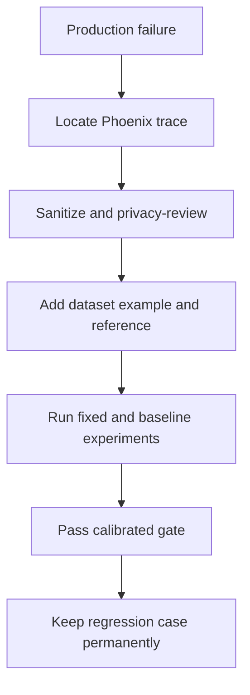

# Datasets, experiments, and regression

## Production traces versus datasets

Production traces show what happened under real traffic. Evaluation datasets provide controlled,
repeatable examples. A dataset example separates input, expected/reference output, and metadata.

Phoenix Client `3.0.0` creation used here:

```python
client.datasets.create_dataset(
    name="exampleco-rag-regression",
    inputs=[{"query": case["query"]} for case in cases],
    outputs=[{"reference_answer": case["reference_answer"]} for case in cases],
    metadata=[{"case_id": case["id"]} for case in cases],
)
```

The local evaluation dataset contains 15 scenarios: correct, hallucinated, irrelevant context,
missing evidence, partial answer, relevant/unfaithful, faithful/irrelevant, safe no-answer, noisy
retrieval, correct/incorrect multi-document synthesis, long context, ambiguity, unsupported user
assumption, and an exception edge case.

## Experiment anatomy

1. Dataset: fixed controlled inputs and references.
2. Task: the candidate RAG pipeline.
3. Evaluators: fixed quality criteria.
4. Metadata: prompt, deployment, Top-K, retriever, dataset version.

```python
client.experiments.run_experiment(
    dataset=dataset,
    task=task,
    evaluators=evaluators,
    experiment_name="prompt-v2-top-k-5",
    experiment_metadata={"prompt_version": "v2", "top_k": 5},
)
```

The task returns answer, contexts, document IDs, latency, and tokens. Evaluator input mapping binds
nested experiment fields to Faithfulness, Answer Relevance, and Reference Correctness.

## Fair comparisons

Change one primary variable at a time. Prompt V1 versus V2 must use the same dataset, model,
retriever, evaluator deployment, rubric, and thresholds. Model A versus B must use the same prompt,
retrieval output, and examples. RAG configuration experiments should record chunking, embedding,
index version, Top-K, filters, and reranker.

Operational metrics matter with quality: an improvement that doubles tokens or p95 latency may not
be acceptable. Compare distributions and category-level failures, not only global averages.

## Production failure to permanent test



For the 45-day refund complaint, preserve the sanitized query and correct 30-day reference. Record
the source trace ID and diagnosed component in metadata, but never copy API keys, headers, PII, or
unreviewed document text. Dataset versioning turns observability evidence into test coverage.

## CI strategy

Run deterministic tests on every PR. Run judge-based evaluation on an appropriate cadence or manual
gate with controlled concurrency because it has cost and variance. Fail on calibrated absolute
thresholds and meaningful regression versus a versioned baseline. Treat the sample thresholds as
examples, not standards.

`scripts/check_regression.py` compares two computed report summaries and fails when any maximize-
direction metric drops by more than `--max-drop`. Store a reviewed baseline as a versioned artifact or
release asset; do not invent one from illustrative documentation values.
