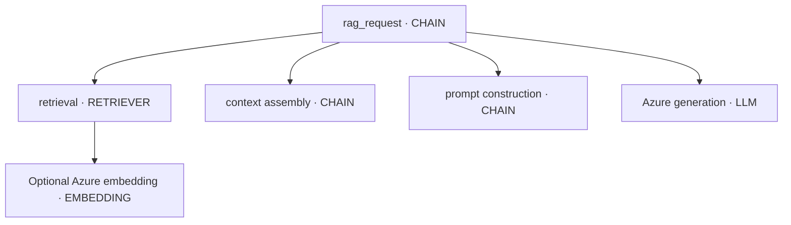

# RAG observability

## Trace model

The root span represents the user-visible operation. Child spans isolate retrieval, context/prompt
assembly, and model work. The application does not fabricate latency: OpenTelemetry calculates span
duration and the wrapper records actual SDK elapsed time.

## Retriever signals

- query and Top-K
- result count
- document IDs and similarity scores
- non-sensitive document metadata
- bounded content previews only when explicitly enabled
- retrieval duration, status, and exceptions

`LexicalRetriever` is deterministic and transparent. `AzureEmbeddingRetriever` caches document
embeddings for the process and traces query/document embedding SDK calls automatically. A production
system would normally use a durable vector store, index version, metadata filters, and a reranker.

## Common failure categories

| Failure | Phoenix evidence | Typical action |
|---|---|---|
| Retrieval failure | Relevant document absent | Re-index, fix query, filters, or embeddings |
| Retrieval noise | Many low-relevance documents and high input tokens | Reduce Top-K or rerank |
| Hallucination | Correct context present; faithfulness low | Strengthen grounding or change model |
| Synthesis failure | Evidence split across documents; output contradicts combination | Improve prompt/chunk relationships |
| Instruction failure | Evidence used but requested answer/format missed | Tighten task instructions |
| Knowledge-base failure | Trace faithfully uses an outdated source version | Correct source and re-index |
| Performance failure | Quality high but one span/tokens dominate | Optimize the measured bottleneck |

## Dashboard checklist

1. Confirm project and environment.
2. Compare root duration with SLO.
3. Open the retriever span and inspect result count, IDs, ranking, and scores.
4. Confirm the correct source version was retrieved.
5. Inspect context size and irrelevant chunks.
6. Inspect prompt version and grounding instruction.
7. Inspect the Azure LLM span, deployment, usage, error status, and response.
8. Review per-document relevance, faithfulness, answer relevance, and correctness.
9. Check for repeated embeddings, LLM calls, or agent/tool loops.
10. Convert confirmed failures into privacy-reviewed regression cases.

## Missing context

The v2 prompt instructs the model to state that the knowledge base is insufficient. This behavior is
safer than answering from model memory. Test missing-context behavior explicitly because retrieval
systems often fail silently.

## Sensitive content

Production retriever spans should favor document IDs, scores, versions, and categories over full
text. Operators with source access can resolve a document ID separately. Apply tenant isolation and
authorization before retrieval; observability must never become a data-exfiltration path.

