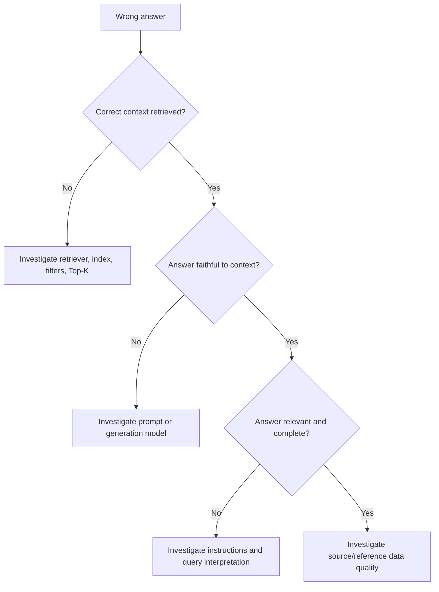

# Troubleshooting and root-cause analysis

## Wrong-answer decision guide



## Refund-period workflow

1. Search by user/session/time/tag and locate the complaint trace.
2. Verify root input and environment/project.
3. Open the retriever span. Was `policy-refund-001` returned? What rank and score?
4. Verify the source version and text say 30 days.
5. Inspect context assembly for truncation or irrelevant noise.
6. Inspect prompt version and grounding instruction.
7. Inspect the Azure span output, token usage, status, and latency.
8. Review document relevance, faithfulness, answer relevance, and correctness.
9. Attribute the failure to retrieval, generation, instruction, data, or operations.
10. Apply the targeted fix and rerun the same regression case as an experiment.

## Diagnostic examples

- Low document relevance + high faithfulness: the model used bad retrieval faithfully.
- High document relevance + low faithfulness: correct evidence was ignored or contradicted.
- High retrieval/faithfulness + low answer relevance: instruction or question handling failed.
- High quality + high latency: inspect span duration, large prompts, repeated calls, and loops.

## Fifteen troubleshooting cases

| # | Symptom | Trace/evaluation signal | Root cause | Remediation |
|---:|---|---|---|---|
| 1 | Refund answer cites password reset | Password doc; relevance low | Wrong document | Fix ranking/filters/Top-K |
| 2 | Existing warranty answer missing | Warranty doc absent | Missing document | Re-index or fix chunking/query |
| 3 | Large, unstable prompt | Many chunks; input tokens high | Retrieval noise | Reduce Top-K or rerank |
| 4 | Invented 60-day refund | 30-day context; faithfulness low | Hallucination | Strengthen grounding/model |
| 5 | Correct context, wrong answer | Retrieval high; correctness low | Prompt/model | Tighten instructions/test model |
| 6 | Warranty exclusions omitted | Evidence present; partial correctness | Incomplete synthesis | Require all question parts |
| 7 | True but irrelevant response | Faithfulness high; relevance low | Instruction failure | Emphasize direct answer |
| 8 | Good but slow answer | LLM span dominates | Slow LLM | Smaller model/output/context |
| 9 | Delay before generation | Retriever span dominates | Slow retriever | Profile store/filter/network |
| 10 | Cost/token spike | Input/total tokens increased | Excess context/calls | Trim and deduplicate |
| 11 | Billing lookup fails | Tool span ERROR | Tool dependency failure | Bounded retry/fallback |
| 12 | Wrong tool chosen | `agent.selected_tool` mismatch | Routing failure | Improve router/evaluate selection |
| 13 | Simple request loops | Duplicate tool spans | Missing stop condition | Cap/deduplicate calls |
| 14 | No model output | Azure timeout/rate limit span | Capacity/network | Backoff, timeout, quota review |
| 15 | Trace agrees with wrong policy | Old source version | Knowledge-base failure | Correct source and re-index |

The machine-readable version is `datasets/troubleshooting_cases.json`.

## Broken-trace laboratory

Run each case with fictional data, then compare trace structure and evaluator outputs:

```bash
python examples/troubleshooting.py broken-retriever
python examples/troubleshooting.py broken-prompt
python examples/troubleshooting.py excessive-context
python examples/troubleshooting.py missing-context
```

Do not mistake a single evaluator label for root cause. Use trace evidence, multiple signals, source
inspection, and human judgment together.

